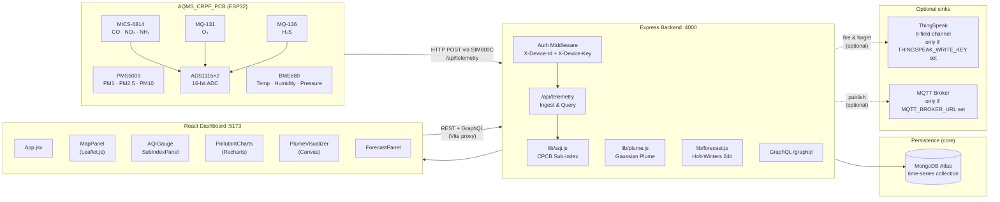
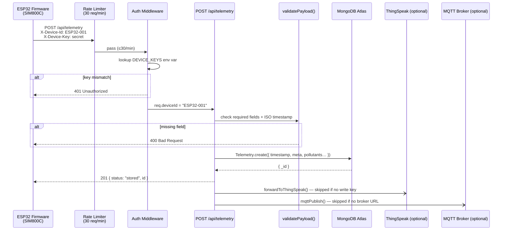
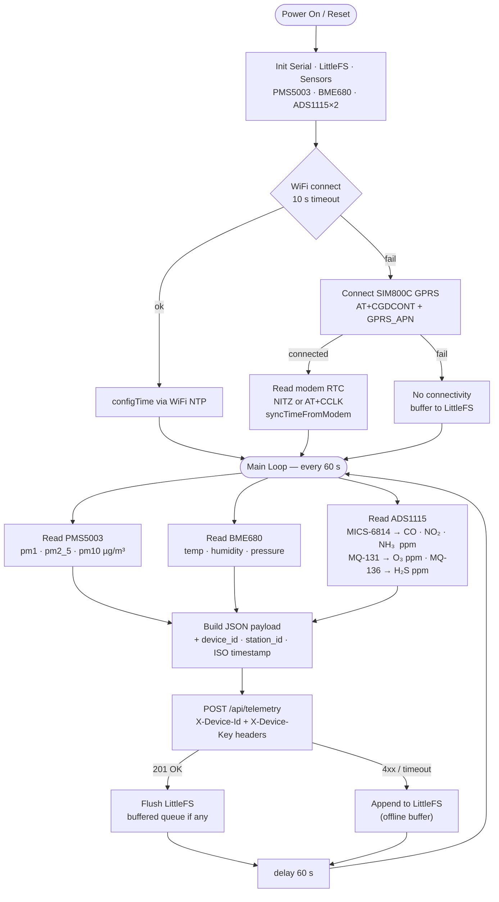
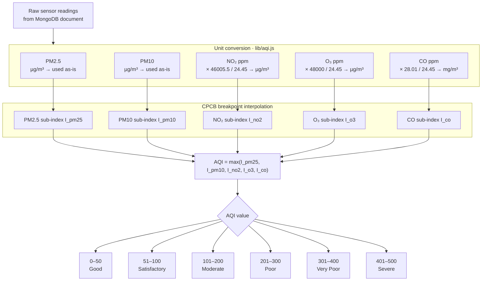
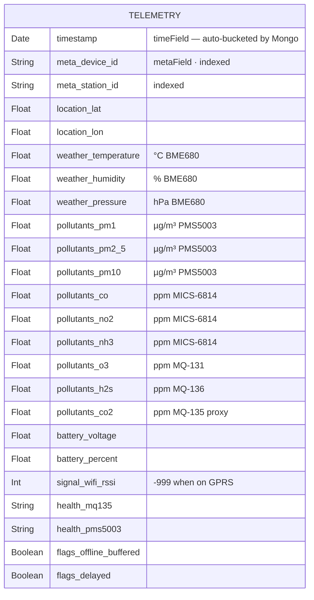
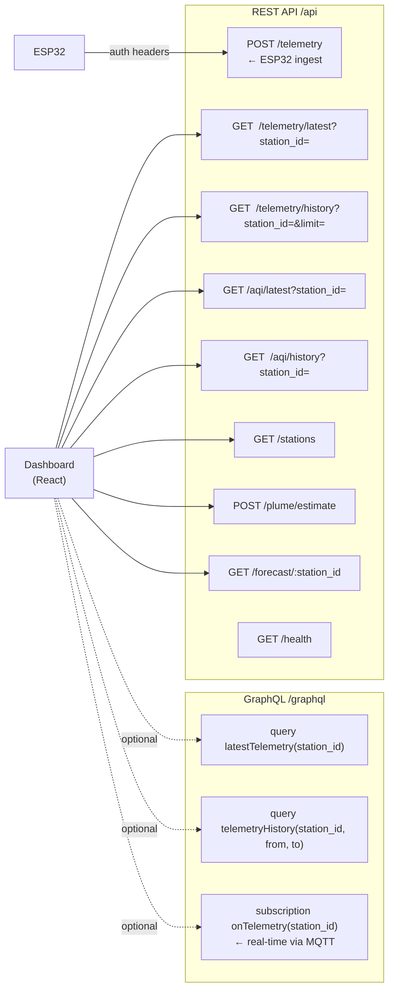
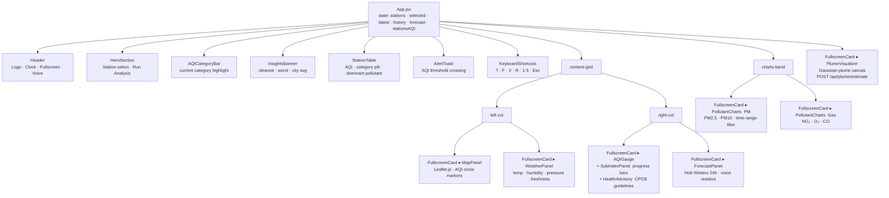
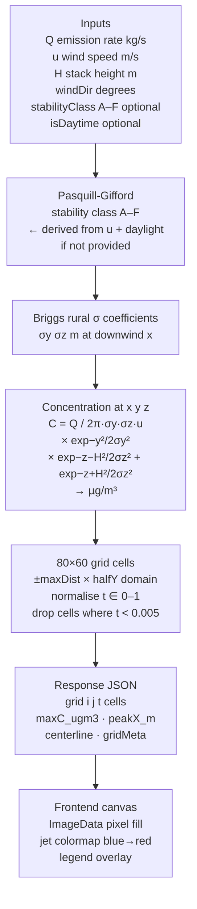
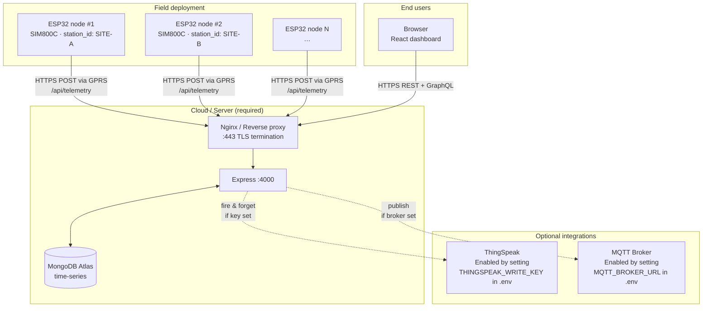

# AQMS — Air Quality Monitoring System

> **ISRO / CRPF collaborative deployment** · ESP32 edge node → Express ingest API → MongoDB Atlas time-series → React dashboard

---

## System Architecture



---

## Data Ingestion Flow



---

## ESP32 Firmware Loop



---

## AQI Sub-index Pipeline  *(CPCB National AQI, India)*



---

## MongoDB Document Schema



---

## REST + GraphQL API



---

## Frontend Component Tree



---

## Gaussian Plume Model



---

## Deployment Topology



---

## Quick Start

**1 — Backend**
```bash
cd backend
cp .env.example .env
# Required: MONGO_URI, DEVICE_KEYS
# Optional: THINGSPEAK_WRITE_KEY, MQTT_BROKER_URL
npm install
npm run dev                 # http://localhost:4000
```

**2 — Frontend**
```bash
cd frontend
npm install
npm run dev                 # http://localhost:5173
```
The Vite proxy rewrites `/api/*` → `http://localhost:4000` — no CORS config needed in dev.

**3 — Firmware (SIM-only deployment)**

Open `firmware/AQMS_Firmware.ino` in Arduino IDE 2. Edit `firmware/config.h`:
```c
// Identity
#define DEVICE_ID        "ESP32-001"
#define STATION_ID       "SITE-A"
#define STATION_LAT       12.9716
#define STATION_LON       77.5946

// SIM800C — primary uplink
#define GPRS_APN         "airtelgprs.com"   // Airtel | "jionet" | "bsnlnet" | "www"
#define SERVER_HOST      "your-backend.onrender.com"
#define SERVER_PORT      80
#define SERVER_PATH      "/api/telemetry"

// Auth — must match DEVICE_KEYS in backend .env
#define DEVICE_API_KEY   "your-secret-key"
```

Flash to ESP32-WROOM-32 at 115200 baud.

> WiFi is attempted first (10 s timeout) then falls back to SIM automatically.
> Time is synced from the modem's RTC (NITZ) — no separate NTP config needed for SIM.

**4 — Adding a station**

Add `ESP32-002:new-key` to `DEVICE_KEYS` in backend `.env`, flash a second board with matching credentials. The new station appears in the dashboard automatically — no backend code changes needed.

---

## Key Contracts

| Layer | Field | Unit | Notes |
|-------|-------|------|-------|
| Firmware → Backend | `pm2_5`, `pm10`, `pm1` | µg/m³ | PMS5003 native output |
| Firmware → Backend | `co`, `no2`, `nh3` | ppm | MICS-6814 after Rs/R0 conversion |
| Firmware → Backend | `o3` | ppm | MQ-131 after conversion |
| Firmware → Backend | `h2s` | ppm | MQ-136 after conversion |
| Backend → Frontend | AQI | 0–500 | Computed by `lib/aqi.js` on every read — not stored in DB |
| Backend → ThingSpeak | field6 | numeric AQI | Only forwarded if `THINGSPEAK_WRITE_KEY` is set |

Gas ppm→µg/m³ conversions happen **only inside `lib/aqi.js`** for breakpoint comparison. MongoDB stores raw ppm values.

---

## Optional Integrations

| Integration | How to enable | What it does |
|------------|--------------|--------------|
| **ThingSpeak** | Set `THINGSPEAK_WRITE_KEY` in `backend/.env` | Mirrors PM2.5/PM10/NO₂/O₃/CO/AQI/Temp/Humidity to an 8-field channel after every POST |
| **MQTT** | Set `MQTT_BROKER_URL` in `backend/.env` | Publishes each telemetry payload to `aqms/<station_id>` topic for real-time subscribers |
| **GraphQL** | Always available at `/graphql` | Queries + subscriptions (subscriptions require MQTT broker) |

Neither ThingSpeak nor MQTT is required for the core pipeline. Omitting their env vars disables them silently.

---

## Project Layout

```
AQMS_Project/
├── firmware/
│   ├── AQMS_Firmware.ino      ESP32 sketch — sensor read + SIM800C HTTP POST
│   ├── config.h               SIM APN · server host · device credentials · pin map
│   ├── .vscode/
│   │   └── c_cpp_properties.json   Arduino includePath for VS Code IntelliSense
│   └── README.md              Library list · calibration notes
├── backend/
│   ├── server.js              Express app + Apollo GraphQL bootstrap
│   ├── routes/
│   │   ├── telemetry.js       POST ingest · GET latest · GET history
│   │   ├── aqi.js             GET latest AQI · GET AQI history
│   │   ├── plume.js           POST /estimate  Gaussian plume grid
│   │   ├── forecast.js        GET Holt-Winters 24h forecast
│   │   └── stations.js        GET distinct station list
│   ├── middleware/
│   │   └── auth.js            X-Device-Id / X-Device-Key check
│   ├── models/
│   │   └── Telemetry.js       Mongoose time-series schema (nh3 + h2s included)
│   ├── lib/
│   │   ├── aqi.js             CPCB sub-index · ppm→µg/m³ conversions
│   │   ├── plume.js           Pasquill-Gifford stability + Briggs rural σ
│   │   ├── forecast.js        Holt-Winters exponential smoothing
│   │   └── thingspeak.js      Optional fire-and-forget ThingSpeak forward
│   ├── graphql/
│   │   └── schema.js          typeDefs + resolvers + subscriptions
│   ├── config/
│   │   ├── db.js              MongoDB Atlas connection + time-series setup
│   │   └── mqtt.js            Optional MQTT broker setup
│   ├── docker-compose.yml     Local Mongo + Mosquitto for dev
│   └── .env.example
└── frontend/
    ├── src/
    │   ├── App.jsx             Root component · 60 s polling · state
    │   ├── api.js              Typed fetch wrappers · latest 2000 records
    │   ├── index.css           Design system tokens + component styles
    │   └── components/
    │       ├── Header.jsx           ECG logo · clock · fullscreen btn
    │       ├── HeroSection.jsx      Landing hero + analysis launcher
    │       ├── AQICategoryBar.jsx   6-category legend strip
    │       ├── InsightsBanner.jsx   City-wide insight pills
    │       ├── StationTable.jsx     Station comparison table
    │       ├── MapPanel.jsx         Raw Leaflet.js station map
    │       ├── AQIGauge.jsx         Radial AQI meter
    │       ├── SubIndexPanel.jsx    Progress bar sub-indices
    │       ├── HealthAdvisory.jsx   CPCB advisory per category
    │       ├── ForecastPanel.jsx    24h forecast chart + voice
    │       ├── WeatherPanel.jsx     BME680 weather card
    │       ├── PollutantCharts.jsx  Recharts · client-side time-range filter
    │       ├── PlumeVisualizer.jsx  Gaussian plume canvas (backend compute)
    │       ├── FullscreenCard.jsx   Maximize-to-overlay wrapper
    │       ├── AlertToast.jsx       AQI threshold crossing toast
    │       └── KeyboardShortcuts.jsx  ? · F · V · R · 1-5 · Esc
    ├── vite.config.js          Port 5173 · /api proxy to :4000
    └── .env.example
```
