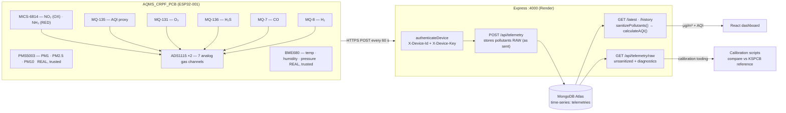
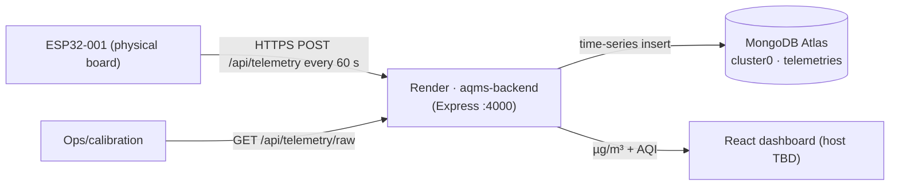

# AQMS System Design

> ISRO / CRPF collaborative deployment · ESP32 edge node → Express ingest → MongoDB Atlas time-series → React dashboard
>
> This document describes the system **as it actually works with the real hardware** — including which channels are trusted, the units contract, and the calibration path for the gas sensors. Supersedes the diagrams in the root `README.md` where they disagree.

---

## 1. End-to-end data flow



---

## 2. Units contract (authoritative)

| Layer | Field | Unit | Notes |
|-------|-------|------|-------|
| Firmware → Backend | `pm1`, `pm2_5`, `pm10` | µg/m³ | PMS5003 native |
| Firmware → Backend | `no2`, `nh3`, `o3`, `h2s`, `h2`, `mq7_co` | µg/m³ | `ppm → µg/m³` via molar volume 24.45 L/mol in firmware (`ppmToUgm3`) |
| Firmware → Backend | `mq135` | unitless | AQI proxy channel, no molar-mass scaling |
| Firmware → Backend | `co` | µg/m³ | **Always `-1`** — MiCS-6814 CO (RED) pin not connected on this PCB |
| Firmware → Backend | `-1` or `null` | sentinel | channel disabled / faulted / out-of-range — never a real value |
| Backend → Frontend | `aqi`, pollutants | µg/m³ | recomputed on every read by `lib/aqi.js`; CO sub-index uses `mq7_co` (÷1000 → mg/m³) |

**Conventions**
- Firmware ships every gas in µg/m³. The backend **never** converts units; it only sanitizes (`lib/aqi.js` `sanitizePollutants`).
- A faulted/disabled channel is `-1` on the wire, stored as sentinel or `null`, and **nulled** in every read path so it cannot affect the AQI.
- Frontend displays raw µg/m³ from the API — **no client-side unit math** (removed in commit `3a92890`; a second conversion was the original cause of AQI 30M+).

---

## 3. Channel trust status (what is real right now)

| Channel | Sensor | Status | Why |
|---------|--------|--------|-----|
| PM1 / PM2.5 / PM10 | PMS5003 | ✅ trusted | genuine laser particle counts, verified live |
| temperature / humidity / pressure | BME680 | ✅ trusted | verified live |
| wifi_rssi | ESP32 | ✅ trusted | verified live |
| CO (`mq7_co`) | MQ-7 | 🔧 calibratable | the only gas channel with real signal range (ratio 0.68–1.28) **and** a KSPCB reference. Calibrated server-side by `scripts/fit-co.js`; trusted only once it appears in `TRUSTED_GAS_CHANNELS` |
| NO₂ | MICS-6814 OX | ❌ never | raw ratio is stuck in a ±10 % noise band around 1.0 — signal-to-noise too poor to fit. Stays nulled permanently |
| NH₃ | MICS-6814 RED | ❌ never | same problem as NO₂ (ratio ≈ 1.00 ± 0.02) |
| O₃ | MQ-131 | ❌ hardware fault | module output pinned near ground (0.021 V, no response) — firmware ships `-1` unconditionally (`ENABLE_GAS_O3 0`) until the module is replaced |
| CO (`co`) | MICS-6814 RED | ❌ disabled | pin not connected on PCB — always `-1` |
| H₂S / H₂ / MQ-135 | MQ-136 / MQ-8 / MQ-135 | ⚠️ trend-only | values move but there is **no reference** to fit against (KSPCB has SO₂, not H₂S; no H₂; MQ-135 is a generic AQ proxy) |

**Trust model:** per-channel, via `TRUSTED_GAS_CHANNELS` env (comma-separated pollutant keys). With it empty (default) the AQI is PM-only (~35–40, Good). A channel only enters the AQI after (a) a saved calibration and (b) explicit opt-in.

**Verdict:** of the seven gas channels, exactly one — MQ-7 CO — is worth calibrating. The rest are excluded for hardware or signal-to-noise reasons, not laziness.

---

## 4. Firmware signal path (per 60 s cycle)

```
BME680.read()        ──► temperature · humidity · pressure · voc_gas_ohm
PMS5003 (cache)      ──► pm1 · pm2_5 · pm10
ADS1115 #1 ch0       ──► vNH3   (MICS-6814 RED)  ─┐
ADS1115 #1 ch1       ──► vNO2   (MICS-6814 OX)    │
ADS1115 #1 ch2       ──► vMQ135                    ├─► gasUgm3(v, R0, A, B, MW, ch)
ADS1115 #1 ch3       ──► vMQ131 (O₃)              │
ADS1115 #2 ch0       ──► vMQ136 (H₂S)              │
ADS1115 #2 ch1       ──► vMQ7   (CO)              │
ADS1115 #2 ch2       ──► vMQ8   (H₂)              ─┘
```

Each gas channel passes through four guards in `gasUgm3()`:

1. **Availability** — ADC I²C dead or channel not present → `-1`.
2. **Rs/Ro operating range** — `rsRatio()` must fall in `RATIO_MIN..RATIO_MAX` (0.02–20.0). The log-log datasheet fits extrapolate to absurd values outside this window (that produced O₃ ≈ 11,000 and NH₃ ≈ 741,000); out-of-range → `-1`.
3. **Below-detection floor** — near Rs/Ro ≈ 1.0 the datasheet power-law is *not defined*: even with a perfect baseline it extrapolates to hundreds of ppm in clean air (CO ≈ 99 ppm, NH₃ ≈ 102 ppm, H₂ ≈ 977 ppm — the residual garbage seen after recalibration). A channel with `|ratio − 1| < DETECT_RATIO_NEAR_1` (0.20) reports **0** = measured, below detection.
4. **Stuck-channel** — if the raw voltage stays within `STUCK_DEADBAND_V` (1 mV) across `STUCK_SAMPLES` (15) consecutive cycles, the channel is frozen (dead sensor / open trace) and reports `-1` with a one-time serial warning. 15 (not 5) because slow MQ/MiCS channels legitimately sit flat for minutes.

The payload also carries a **`diagnostics`** block — raw `ads1_voltages`/`ads2_voltages` per channel and the stored `baselines` — so calibration can inspect the board's true electrical state. `diagnostics` is persisted but never used for AQI.

---

## 5. Ingestion & read paths (backend)

### POST /api/telemetry
- Auth: `X-Device-Id` + `X-Device-Key` against `DEVICE_KEYS` env var → `401` on mismatch; rate-limited to 30/min.
- Validation: `device_id`, `station_id`, `timestamp` (ISO), `pollutants` required; `device_id` must match the authenticated device.
- **Stores pollutants exactly as sent** (raw = diagnostic source of truth). Health `FAULT` fields are surfaced as `alert: { hasFault, faulty }`.
- Fire-and-forget optional sinks: MQTT publish + ThingSpeak forward.

### GET /api/telemetry/latest & /history
- Query by `device_id` or `station_id` (dynamic field).
- **Every read runs `preparePollutants()`** — `applyCalibration()` (overwrite firmware gas placeholders with any stored per-device calibration) then `sanitizePollutants()` (null disabled/faulted channels and every gas channel not in `TRUSTED_GAS_CHANNELS`) — then `calculateAQI()`. The same pipeline feeds the AQI routes and the GraphQL resolvers, so the dashboard and AQI always agree.

### GET /api/telemetry/raw
- Calibration-only: returns pollutants **unsanitized** plus the `diagnostics` block. Never used by the dashboard.

### Sanity caps (`lib/aqi.js`)
- Each channel is capped (e.g. `pm2_5: 1000`, `mq7_co: 100000`); out-of-range → null. AQI is clamped to 0–500.

---

## 6. AQI computation (CPCB national AQI, India)

`lib/aqi.js` recomputes AQI on every read from the sanitized pollutants:

```
sub-index(p) = ((I_hi − I_lo) / (BP_hi − BP_lo)) × (p − BP_lo) + I_lo
AQI          = max(sub-index(pm2_5, pm10, no2, o3, co_from_mq7_co, nh3?))
category     0–50 Good · 51–100 Satisfactory · 101–200 Moderate
             201–300 Poor · 301–400 Very Poor · 401–500 Severe
```

With an empty `TRUSTED_GAS_CHANNELS`, the gas set is empty → AQI is max of the PM sub-indices only.

---

## 7. Calibration workflow (gas sensors)

Goal: turn the MQ-7 CO channel into trustworthy µg/m³. Only CO is calibratable —
the other gas channels are excluded for hardware / signal-to-noise reasons (see §3).

### Baseline (firmware, on-board)
1. **Warm-up** — MQ/MiCS sensors need to settle. First boot runs a 30-min non-blocking warm-up before capturing R0; serial `CAL` uses 10 min; the midnight job uses 1 min (sensors already hot).
2. **Baseline** — serial `WIPE` deletes `/baseline.dat` and re-captures R0 after a 30-min warm-up in known-clean air. The 50 %-drift sanity guard rejects a capture taken in dirty air.
3. **Below-detection** — with a valid baseline, any channel near Rs/Ro ≈ 1.0 reports `0` (below detection) instead of the datasheet power-law's clean-air garbage.

### CO scale calibration (backend, KSPCB fit)
The firmware ships `mq7_co` from datasheet coefficients that are orders of magnitude off. `backend/scripts/fit-co.js` fits a per-device power law

```
ppm = a · ratio^b        (ratio = Rs/R0, recomputed from diagnostics voltage + baseline)
```

against the KSPCB reference already in the DB. **Because the KSPCB data is historical (2018–2023) and the device is live, timestamps never overlap**, so the script fits the *diurnal climatology*: the device's hour-of-day mean ratio vs the nearest KSPCB station's hour-of-day mean CO. This anchors scale to typical urban CO but is **not** a same-place, same-time calibration — expect a rough fit (reference station is ~100 km away in Bangalore).

Acceptance bar (all required, else nothing is saved):
- ≥ `MIN_HOURS` (12) of device hour-of-day coverage
- log-log `R² ≥ 0.25`
- physically-sane negative exponent `−20 < b < −0.5`

A passing fit writes a `Calibration` doc (`calibrations` collection): `model {a,b}`, `validRatioMin/Max`, `metrics {r2, mae, n}`. Every read path (`lib/prepare.js` → `lib/gasCal.js`) then replaces the firmware's `mq7_co` with the fitted value, and nulls it whenever the ratio falls outside the fitted window.

### Enable
Set `TRUSTED_GAS_CHANNELS=mq7_co` in the backend env **only after** a fit has been saved and the resulting room-air readings look plausible. All other gas channels are never trusted.

### Future upgrade (gold standard)
A **span-gas bump test** (certified CO can, e.g. 50 ppm) would give a true two-point calibration: a serial `CALCO <ppm>` command that samples the sensor under the can and solves the curve directly. This is standard practice for CO monitors and would make the fitted curve rigorous instead of statistical. The `Calibration` model already supports storing it — only the firmware `CALCO` command and the physical can are missing.

---

## 8. Deployment topology



- **Backend:** Render blueprint (`render.yaml`) — auto-deploys on push to `main`. Base URL `https://aqms-dedk.onrender.com`.
- **Database:** MongoDB Atlas time-series collection `telemetries` (timeField `timestamp`, metaField `meta`, granularity `minutes`, index `(meta.device_id, timestamp)`).
- **Auth:** `DEVICE_KEYS=ESP32-001:AQMI-DEVICE-01` on the server; firmware `DEVICE_API_KEY=AQMI-DEVICE-01` matches.
- **Frontend:** React + Vite. **Not yet deployed** — dashboard host undecided (Vercel/Netlify/Render static).

---

## 9. Open items

1. Frontend deployment host — dashboard fix (commit `3a92890`) is built but not live anywhere.
2. Reflash the board with the below-detection floor + `ENABLE_GAS_O3 0` firmware, then let it soak so `scripts/fit-co.js` has enough hour-of-day coverage for a CO calibration.
3. Run `scripts/cleanup-1970.js` on the live DB to purge the pre-NTP 1970-timestamp rows.
4. Replace the dead MQ-131 (O₃) module if O₃ is ever wanted — the channel is permanently faulted until then.
5. Root `README.md` diagrams still describe the pre-refactor system (ppm storage, old schema) and should be brought in line with this document.
6. Optional rigor upgrade: span-gas can (50 ppm CO) + `CALCO` firmware command for a true two-point CO calibration.
