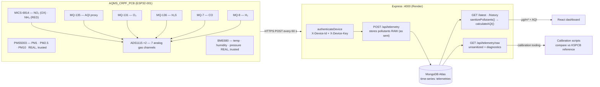
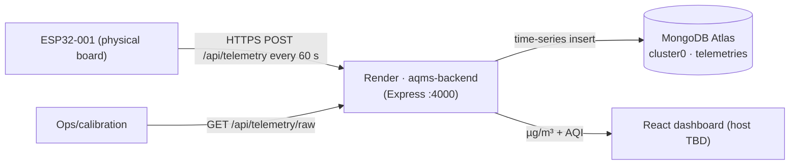

# AQMS System Design

> ISRO / CRPF collaborative deployment · ESP32 edge node → Express ingest → MongoDB Atlas time-series → React dashboard
>
> This document describes the system **as it actually works with the real hardware** — including which channels are trusted, the units contract, and the calibration path for the gas sensors. Supersedes the diagrams in the root `README.md` where they disagree.

---

## 1. End-to-end data flow



---

## 2. Units contract (authoritative)

| Layer | Field | Unit | Notes |
|-------|-------|------|-------|
| Firmware → Backend | `pm1`, `pm2_5`, `pm10` | µg/m³ | PMS5003 native |
| Firmware → Backend | `no2`, `nh3`, `o3`, `h2s`, `h2`, `mq7_co` | µg/m³ | `ppm → µg/m³` via molar volume 24.45 L/mol in firmware (`ppmToUgm3`) |
| Firmware → Backend | `mq135` | unitless | AQI proxy channel, no molar-mass scaling |
| Firmware → Backend | `co` | µg/m³ | **Always `-1`** — MiCS-6814 CO (RED) pin not connected on this PCB |
| Firmware → Backend | `-1` or `null` | sentinel | channel disabled / faulted / out-of-range — never a real value |
| Backend → Frontend | `aqi`, pollutants | µg/m³ | recomputed on every read by `lib/aqi.js`; CO sub-index uses `mq7_co` (÷1000 → mg/m³) |

**Conventions**
- Firmware ships every gas in µg/m³. The backend **never** converts units; it only sanitizes (`lib/aqi.js` `sanitizePollutants`).
- A faulted/disabled channel is `-1` on the wire, stored as sentinel or `null`, and **nulled** in every read path so it cannot affect the AQI.
- Frontend displays raw µg/m³ from the API — **no client-side unit math** (removed in commit `3a92890`; a second conversion was the original cause of AQI 30M+).

---

## 3. Channel trust status (what is real right now)

| Channel | Sensor | Status | Why |
|---------|--------|--------|-----|
| PM1 / PM2.5 / PM10 | PMS5003 | ✅ trusted | genuine laser particle counts, verified live |
| temperature / humidity / pressure | BME680 | ✅ trusted | verified live |
| wifi_rssi | ESP32 | ✅ trusted | verified live |
| NO₂ | MICS-6814 OX | ⚠️ frozen | raw ADC voltage does not move (`STUCK_DEADBAND_V`) — reports FAULT (`-1`) |
| NH₃ | MICS-6814 RED | ⚠️ frozen | previously stuck at ~741,658 — now FAULT (`-1`) |
| O₃ | MQ-131 | ⚠️ frozen | previously stuck at ~11,386 — now FAULT (`-1`) |
| CO | MICS-6814 RED | ❌ disabled | pin not connected on PCB — always `-1` |
| H₂S / H₂ / MQ-135 / MQ-7 CO | MQ-136 / MQ-8 / MQ-135 / MQ-7 | ⚠️ uncalibrated | values change but curve is placeholder; excluded until calibrated |

**Consequence:** with `TRUST_GAS_SENSORS=false` (default) the AQI is computed from PM only (~35–40, Good). Gas channels only enter the AQI after the calibration workflow below.

---

## 4. Firmware signal path (per 60 s cycle)

```
BME680.read()        ──► temperature · humidity · pressure · voc_gas_ohm
PMS5003 (cache)      ──► pm1 · pm2_5 · pm10
ADS1115 #1 ch0       ──► vNH3   (MICS-6814 RED)  ─┐
ADS1115 #1 ch1       ──► vNO2   (MICS-6814 OX)    │
ADS1115 #1 ch2       ──► vMQ135                    ├─► gasUgm3(v, R0, A, B, MW, ch)
ADS1115 #1 ch3       ──► vMQ131 (O₃)              │
ADS1115 #2 ch0       ──► vMQ136 (H₂S)              │
ADS1115 #2 ch1       ──► vMQ7   (CO)              │
ADS1115 #2 ch2       ──► vMQ8   (H₂)              ─┘
```

Each gas channel passes through three guards in `gasUgm3()`:

1. **Availability** — ADC I²C dead or channel not present → `-1`.
2. **Rs/Ro operating range** — `rsRatio()` must fall in `RATIO_MIN..RATIO_MAX` (0.02–20.0). The log-log datasheet fits extrapolate to absurd values outside this window (that produced O₃ ≈ 11,000 and NH₃ ≈ 741,000); out-of-range → `-1`.
3. **Stuck-channel** — if the raw voltage stays within `STUCK_DEADBAND_V` (1 mV) across `STUCK_SAMPLES` (5) consecutive cycles, the channel is frozen (dead sensor / open trace) and reports `-1` with a one-time serial warning.

The payload also carries a **`diagnostics`** block — raw `ads1_voltages`/`ads2_voltages` per channel and the stored `baselines` — so calibration can inspect the board's true electrical state. `diagnostics` is persisted but never used for AQI.

---

## 5. Ingestion & read paths (backend)

### POST /api/telemetry
- Auth: `X-Device-Id` + `X-Device-Key` against `DEVICE_KEYS` env var → `401` on mismatch; rate-limited to 30/min.
- Validation: `device_id`, `station_id`, `timestamp` (ISO), `pollutants` required; `device_id` must match the authenticated device.
- **Stores pollutants exactly as sent** (raw = diagnostic source of truth). Health `FAULT` fields are surfaced as `alert: { hasFault, faulty }`.
- Fire-and-forget optional sinks: MQTT publish + ThingSpeak forward.

### GET /api/telemetry/latest & /history
- Query by `device_id` or `station_id` (dynamic field).
- **Every read applies `sanitizePollutants()` then `calculateAQI()`** — so the AQI is always correct even for historical garbage rows, and `TRUST_GAS_SENSORS=false` nulls gas channels before AQI math.

### GET /api/telemetry/raw
- Calibration-only: returns pollutants **unsanitized** plus the `diagnostics` block. Never used by the dashboard.

### Sanity caps (`lib/aqi.js`)
- Each channel is capped (e.g. `pm2_5: 1000`, `mq7_co: 100000`); out-of-range → null. AQI is clamped to 0–500.

---

## 6. AQI computation (CPCB national AQI, India)

`lib/aqi.js` recomputes AQI on every read from the sanitized pollutants:

```
sub-index(p) = ((I_hi − I_lo) / (BP_hi − BP_lo)) × (p − BP_lo) + I_lo
AQI          = max(sub-index(pm2_5, pm10, no2, o3, co_from_mq7_co, nh3?))
category     0–50 Good · 51–100 Satisfactory · 101–200 Moderate
             201–300 Poor · 301–400 Very Poor · 401–500 Severe
```

With `TRUST_GAS_SENSORS=false`, the gas set is empty → AQI is max of the PM sub-indices only.

---

## 7. Calibration workflow (gas sensors)

Goal: turn the four in-range-but-rough gas channels into trustworthy µg/m³, validated against the KSPCB reference data already in the DB (`KSPCB-*` stations, seeded via `backend/scripts/seed-kspcb.js`).

1. **Collect raw diagnostics** — with the reflashed firmware (µg/m³ + guards + `diagnostics`), poll `GET /api/telemetry/raw?device_id=ESP32-001&from=...` for a full clean-air period (24–48 h).
2. **Confirm channels move** — a usable channel's `ads*_voltages` must vary well beyond `STUCK_DEADBAND_V`. Frozen channels (currently NO₂, NH₃, O₃) are electrical problems, not curve problems: re-check the header/jumper/pin assignments before calibrating them.
3. **Baseline** — delete `/baseline.dat` on the board so R0 is re-captured in clean air; let it settle (MQ sensors want 24–48 h warm-up before a *true* R0).
4. **Curve fit** — replace the placeholder `GAS_A_*`/`GAS_B_*` coefficients with datasheet or gas-chamber fits; verify the resulting µg/m³ tracks the KSPCB station nearest the deployment within an agreed tolerance.
5. **Enable** — set `TRUST_GAS_SENSORS=true` in the backend env only after the raw→µg/m³ values look physically plausible on the dashboard.

---

## 8. Deployment topology



- **Backend:** Render blueprint (`render.yaml`) — auto-deploys on push to `main`. Base URL `https://aqms-dedk.onrender.com`.
- **Database:** MongoDB Atlas time-series collection `telemetries` (timeField `timestamp`, metaField `meta`, granularity `minutes`, index `(meta.device_id, timestamp)`).
- **Auth:** `DEVICE_KEYS=ESP32-001:AQMI-DEVICE-01` on the server; firmware `DEVICE_API_KEY=AQMI-DEVICE-01` matches.
- **Frontend:** React + Vite. **Not yet deployed** — dashboard host undecided (Vercel/Netlify/Render static).

---

## 9. Open items

1. Frontend deployment host — dashboard fix (commit `3a92890`) is built but not live anywhere.
2. Fresh serial payload from the reflashed board to confirm the µg/m³ + guards behave before a long calibration soak.
3. PCB verification of the frozen channels (NO₂ / NH₃ / O₃) — stuck voltage at the ADC suggests a hardware/assumed-pinmap issue, not a calibration issue.
4. Root `README.md` diagrams still describe the pre-refactor system (ppm storage, old schema) and should be brought in line with this document.
